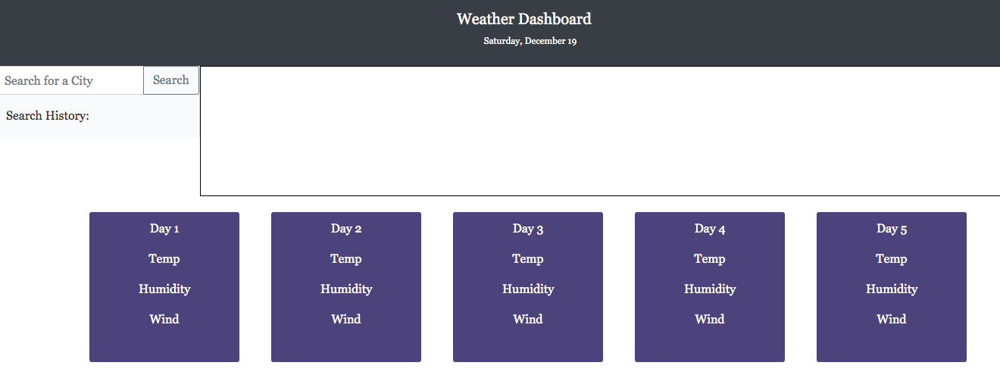

# Weather-API-Site

This Weather Application allows the user to input any city into the search bar and the current weather in that city will appear. Along with this, the next five days' weather will appear as well.

This was made with Javascript and HTML, styled with Bootstrap and CSS, and linked to the Open Weather API. 

[Click here to see the live site!](https://margaretelson.github.io/Weather-API-Site/)

## Built With

The following features were used in creating this website:
* HTML
* CSS
* Bootstrap
* JavaScript
* JQuery
* Git & Git workflow
* GitHub

## Installation

Use VSCode to install.

## License

MIT License

- Copyright (c) 2020 Margaret Elson
